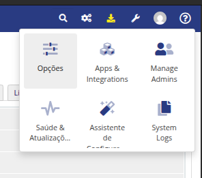
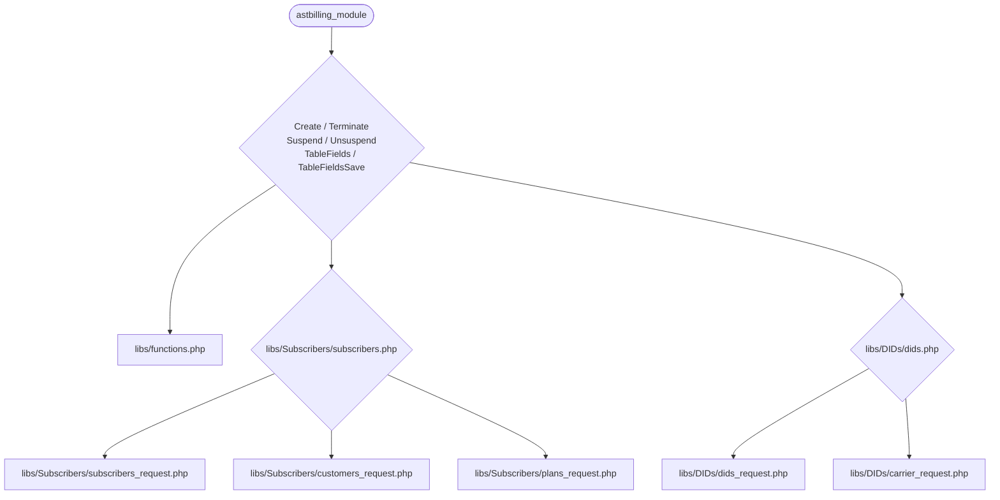
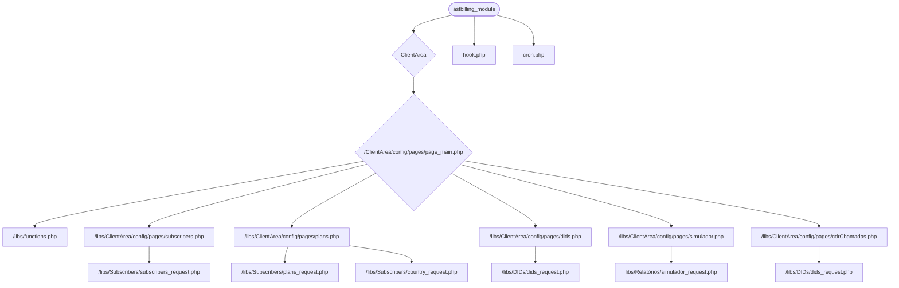

# Módulo Server WHMCS / Astbilling

Este módulo foi desenvolvido para integrar e administrar o Astbilling, um sistema interno da BRDSOFT, diretamente pelo WHMCS. Ele otimiza a gestão de serviços de telefonia corporativa, oferecendo as seguintes funcionalidades:

* __**Controle Administrativo:**__ Gerencia configurações e operações gerais através do Módulo Addon no painel administrativo do WHMCS.

__**Interação com o Cliente:**__ Permite que os clientes gerenciem seus serviços e informações diretamente na Área do Cliente, utilizando o Módulo de Provisionamento.

__**Automação de Serviços e Faturamento:**__ Administra clientes, assinantes, planos e DIDs da Telefonia Corporativa por meio dos Produtos/Serviços do Módulo de Provisionamento. Isso inclui a geração automática de faturas mensais, com base nos relatórios de chamadas.

* Controle da Área de Administrativa, usando o **Módulo Addon**.
* Interações com os clientes na Área do Cliente usando o **Módulo de Provisionamento**.
* Manipulação dos clientes, assinantes, planos e dids, cadastrados na Telefonia Corporativa, usando os Produtos/Serviços do **Módulo de Provisionamento**, gerando enfim as faturas com base no relatório de chamadas de cada mês.

### Sobre o Astbilling

O Astbilling é um sistema para a administração de serviços de empresas de telefonia. Ele permite o cadastro e a gestão completa de clientes, assinantes, DIDs, planos, troncos, operadoras, rotas e tarifas, abrangendo todos os produtos e serviços típicos de uma empresa de Telefonia Corporativa.

## 🛠️ Tecnologias Utilizadas.

No desenvolvimento do projeto foram utilizadas as seguintes tecnologias:

* **WHMCS:** [8.9.0](https://docs.whmcs.com/8-0-9/)
* **PHP:** [8.1](https://www.php.net/)
* **MariaDB**: [10.11.11](https://mariadb.org/)
* **Smarty:*** [3.0](https://www.smarty.net/)
* **CSS:** [CSS3](https://developer.mozilla.org/pt-BR/docs/Web/CSS)
* **Boostrap:** [3.4.1](https://getbootstrap.com/)
* **JavaScript:** [ECMASCRIPT (ES)](https://developer.mozilla.org/pt-BR/docs/Web/JavaScript)
* **jQuery:** [1.12.4](https://jquery.com/)
* **DataTables:** [2.3.0](https://datatables.net/)
* **Git:** [2.39.5](https://git-scm.com/)

## ⚙️ Instalação.

Siga os passos abaixo para instalar e configurar os módulos Astbilling no seu ambiente WHMCS:

1. Copie a pasta do Módulo de Provisionamento __**"astbilling_module"**__ para **(html/modules/servers)**.

2. Copie a pasta do Módulo Addon __**"astbilling_addon"**__ para **(html/modules/addons)**.

3. Acesse as configurações de produtos e serviços no seu painel administrativo do WHMCS.




4. Crie um **Novo Grupo** e um **Novo Produto**, ou simplesmente um **Novo Produto** em um grupo existente.

4. Crie um **Novo Grupo de Produtos** e um **Novo Produto**, ou adicione um **Novo Produto** a um grupo existente.


5. Após criar o produto, edite suas configurações.


6. Defina os **Detalhes** e o **Preço** do produto conforme necessário.


7. Na aba **Configurações do Módulo**, aplique as configurações principais do módulo de provisionamento.


8. Na aba **Campos Personalizados**, defina o campo personalizado para o **DDD**.


9. Ainda na aba **Configurações do Módulo**, acesse as **Opções Configuráveis**.


10. Crie um **Novo Grupo** de opções configuráveis. 


11. Aplique as especificações do grupo para o módulo de produtos do Astbilling e adicione uma nova opção de configuração para definir os Canais. Salve todas as alterações.


12. Na aba **Configurações do Módulo**, navegue até a área de **Addons dos Produtos** e clique em **Adicionar Novo Addon**. Esta área será utilizada para a configuração dos DIDs.


13. Aplique as configurações do Addon e clique em **Continuar**.


14. Nas **Configurações do Addon**, defina os **Detalhes**, **Preço**, **Configurações do Módulo** e **Campos Personalizados**. Os campos personalizados são exibidos nas imagens abaixo.


Na aba de **Campos Personalizados** teremos os seguintes campos.


15. Para ativar o **Módulo do Addon**, acesse a aba de configurações de Addons no WHMCS.


16. Na área de **Configurações do Addon**, ative o módulo Astbilling. Após a ativação, clique no botão para configurá-lo, marque a opção **Full Administrator** e clique em **Salvar**.


17. Com o módulo configurado, ele estará acessível na área superior do painel administrativo do WHMCS.


18. **Configure o Cron Job (Retorno do Arquivo do Relatório de Chamadas)**: No terminal do seu servidor, acesse ***cd /etc/cron.d***. Crie um novo arquivo neste diretório com o seguinte conteúdo para agendar a execução diária do script de atualização (Esse comando estará rodando de minuto em minuto):

```bash

    * * * * * root php8.1 /caminho/completo/para/o/seu/whmcs/modules/servers/astbilling_modules/cron.php

``` 

**Importante**: Substitua ***/caminho/completo/para/o/seu/whmcs/*** pelo caminho real da sua instalação do WHMCS no servidor. Este cron job é crucial para o processamento automático e retorno dos arquivos CSV dos **Relatórios de Chamadas** de consumo de cada cliente em cada fatura gerada.

## Como rodar os testes

1. Crie uma **Nova Ordem de Serviço**. Nesta ordem, defina o **Cliente**, selecione o produto **Telefonia Corporativa** e informe o **DDD**.

* **Nome do Assinante**: Se o assinante já existir no ambiente Astbilling ou se você quiser um nome customizável, preencha o campo Domínio com o username desejado. Caso contrário, o nome do assinante será gerado automaticamente a partir do primeiro nome do cliente concatenado com o identificador do pedido.
Após o preenchimento, clique em **Enviar Pedido**.


### Observação:

A junção do nome e sobrenome do cliente no WHMCS corresponde ao nome do cliente no Astbilling.

2. Na página do pedido, clique no botão Criar para provisionar o assinante. Uma vez criado, o administrador poderá ajustar as configurações do assinante. Se houver quaisquer alterações, clique em **Salvar Alterações**.


3. Os DIDs estão diretamente vinculados ao assinante. Para criá-los, clique no botão New Addon. Configure o **novo Addon** e clique em **Salvar Alterações**.


4. Após salvar, você será redirecionado para a página do pedido. O novo Addon aparecerá na seção de addons do pedido. Agora, edite este Addon.


5. Preencha os campos necessários e clique em **Salvar Alterações**. Em seguida, clique no botão **Criar** para finalizar o provisionamento do Addon. Após a criação clique no botão para **Salvar as Alterações** novamente.


6. Realize algumas chamadas utilizando este assinante. Depois, na aba do perfil do cliente, selecione o produto correspondente ao assinante e gere a fatura. O consumo será adicionado à fatura gerada.


7. No perfil do cliente, acesse a **Área do Cliente**. Nesta área, você poderá visualizar como o cliente irá interagir com o módulo, e a **Telefonia Corporativa**.


## ℹ️ Informações sobre a aplicação.



### Arquivos e Funções (Produtos/Serviços):

***astbilling_module.php:***

* Arquivo principal do módulo de provisionamento no WHMCS.

* Responsável pela configuração de variáveis globais e pela implementação das funções nativas do WHMCS, incluindo:

***CreateAccount***: Para criar assinantes e DIDs.

***SuspendAccount***: Para suspender assinantes e DIDs.

***UnsuspendAccount***: Para reativar assinantes e DIDs.

***TerminateAccount***: Para excluir assinantes e DIDs.

***AdminTableFields***: Para definir os campos administrativos na área de produtos.

***AdminSaveTableFields***: Para salvar alterações nos campos administrativos da área de produtos.

***ClientArea***: Para criar a interface de templates na área do cliente.<br><br>

***libs/functions.php***:

* Contém as funções utilitárias principais do módulo.

* Responsável pela criação do array de variáveis globais, envio de requisições, geração de logs, montagem de templates de erro e verificação do token de acesso ao Astbilling.<br><br>

***libs/Subscribers/subscribers.php***:

* Gerencia as funções nativas de manipulação de produtos do WHMCS, especificamente para Assinantes.<br><br>

***libs/Subscribers/subscribers_request.php***:

* Contém as funções de envio de requisições para manipular Assinantes no ambiente Astbilling.<br><br>

***libs/Subscribers/plans_request.php***:

* Contém as funções de envio de requisições para manipular Planos no ambiente Astbilling.<br><br>

***libs/Subscribers/customers_request.php***:

* Contém as funções de envio de requisições para manipular Clientes no ambiente Astbilling.<br><br>

***libs/DIDs/dids.php***:

* Gerencia as funções nativas de manipulação de produtos do WHMCS, especificamente para DIDs.

***(Nota***: Movi este arquivo para o diretório libs/DIDs para consistência e clareza, pois o conteúdo é sobre DIDs e não Subscribers.)

***libs/DIDs/dids_request.php***:

* Contém as funções de envio de requisições para manipular DIDs no ambiente Astbilling.<br><br>

***libs/Subscribers/carrier_request.php***:

* Contém as funções de envio de requisições para manipular Operadoras no ambiente Astbilling.<br><br>



### Arquivos e Funções (ClientArea):

***libs/clientArea/config/pages/page_main.php***:

* Este arquivo atua como um roteador de requisições. Ele verifica qual formulário enviou a requisição e redireciona para o controlador específico responsável pelo processamento.

***libs/clientArea/config/pages/subscribers.php***:

* Controla a lógica e a geração da página dedicada à gestão de Assinantes na Área do Cliente.

***libs/clientArea/config/pages/plans.php***:

* Controla a lógica e a geração da página dedicada à visualização de Planos na Área do Cliente.

***libs/clientArea/config/pages/dids.php***:

* Controla a lógica e a geração da página dedicada à gestão de DIDs (Direct Inward Dialing) na Área do Cliente.

***libs/clientArea/config/pages/simulador.php***:

* Controla a lógica e a geração da página do Simulador de Chamadas na Área do Cliente.

***libs/clientArea/config/pages/cdrChamadas.php***:

* Controla a lógica e a geração da página de CDRs (Call Detail Records), exibindo os registros de chamadas do dia para o cliente.

### Arquivos (Cron e Hook).

***hook.php***:

* Este arquivo é responsável por interceptar eventos do WHMCS. Ele envia requisições para obter o relatório de chamadas de um determinado período de fatura e, em seguida, atualiza a fatura existente, adicionando o valor do consumo de chamadas do cliente durante o mês.

***cron.php***:

* Configurado como um Cron Job, este arquivo executa a cada minuto. Ele verifica no banco de dados se alguma fatura foi gerada e processa o Relatório de Chamadas correspondente, disponibilizando-o como um arquivo CSV para download na Área do Cliente.