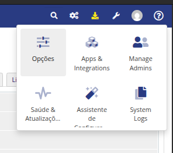
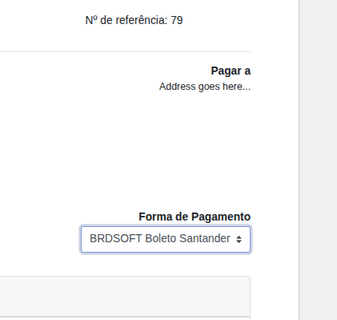
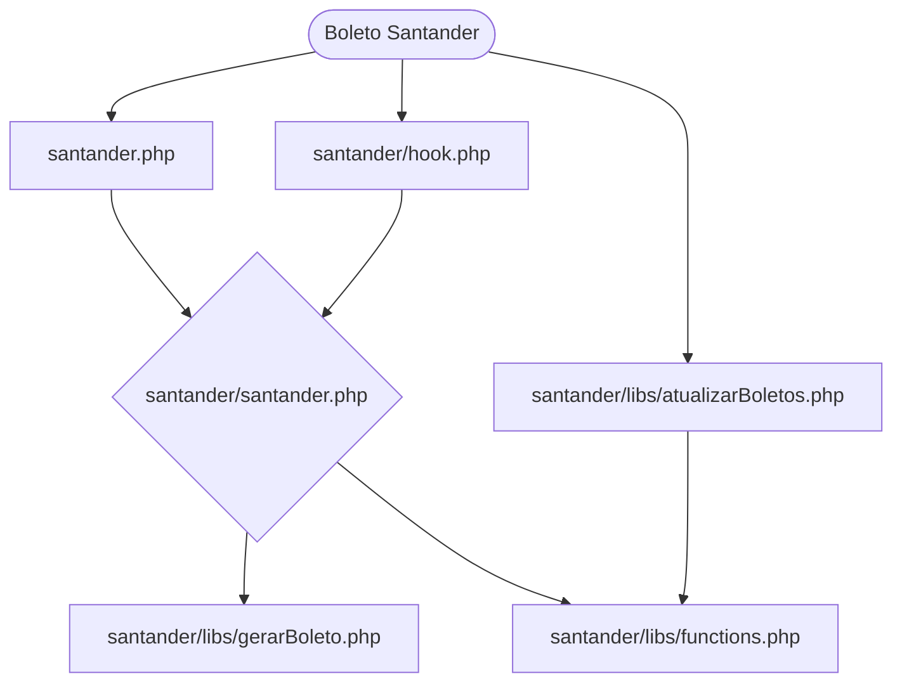

# Módulo Server WHMCS / Boleto Santander

Este módulo foi desenvolvido para integrar a emissão de boletos bancários do Banco Santander diretamente com o sistema WHMCS, facilitando o processo de pagamento para seus clientes. Ele otimiza a gestão financeira e oferece as seguintes funcionalidades principais:

* **Controle Administrativo**: Gerencia todas as configurações e operações relacionadas à emissão de boletos Santander através de um Módulo Addon dedicado no painel administrativo do WHMCS. Isso inclui a configuração de credenciais, carteira de cobrança, instruções do boleto, e outras definições necessárias para a comunicação com o banco.

## Tecnologias Utilizadas 🛠️

No desenvolvimento do projeto foram utilizadas as seguintes tecnologias:

* **WHMCS:** [8.9.0](https://docs.whmcs.com/8-0-9/)
* **PHP:** [8.1](https://www.php.net/)
* **MariaDB**: [10.11.11](https://mariadb.org/)
* **Smarty:*** [3.0](https://www.smarty.net/)
* **CSS:** [CSS3](https://developer.mozilla.org/pt-BR/docs/Web/CSS)
* **Boostrap:** [3.4.1](https://getbootstrap.com/)
* **JavaScript:** [ECMASCRIPT (ES)](https://developer.mozilla.org/pt-BR/docs/Web/JavaScript)
* **jQuery:** [1.12.4](https://jquery.com/)
* **DataTables:** [2.3.0](https://datatables.net/)
* **Git:** [2.39.5](https://git-scm.com/)

## ⚙️ Instalação.

Siga os passos abaixo para instalar e configurar os módulos de geração de boletos do Banco Santander no seu ambiente WHMCS:

1. Copie a pasta do Módulo Gateways **santander**, e o arquivo **santander.php**  para **(html/modules/gateways)**.

2. Copie a pasta do Módulo Addon __**"santander_addon"**__ para **(html/modules/addons)**.

3. Nas **Configurações do WHMCS**, acesse **Apps & Integrações**. Utilize o campo de pesquisa para encontrar **Santander**, e ative ambos os módulos: o Gateway e o Addon.




4. Acesse os **Portais de Pagamento** nas **Configurações do WHMCS**. Configure o módulo de acordo com os campos especificados no formulário, como credenciais bancárias e carteira de cobrança. Após a configuração, clique em **Salvar Alterações**.


5. Nas **Configurações do WHMCS**, acesse **Campos Personalizados**. Crie os campos necessários para configurar **Boletos Automáticos** e para coletar o **CPF/CNPJ** no perfil de cada cliente.


6. Acesse o **Módulo do Addon** do Santander na opção Addons, localizada na Navbar do WHMCS. Ao acessar, configure os campos para leitura na aba de configurações do módulo. Após configurado, clique em **Salvar**.


7. Ao abrir uma fatura, basta selecionar o **Método de Pagamento** para **Boleto Santander**. Caso a opção Boleto Automático esteja marcada como **Sim** no perfil do cliente, o boleto será gerado automaticamente.



8. **Configure o Cron Job (Retorno Bancário)**: No terminal do seu servidor, acesse ***cd /etc/cron.d***. Crie um novo arquivo neste diretório com o seguinte conteúdo para agendar a execução diária do script de atualização (geralmente às 06:00 AM):

```bash

    0 6 * * * root curl -s /caminho/completo/para/o/seu/whmcs/modules/gateways/santander/libs/atualizar.php

``` 

**Importante**: Substitua ***/caminho/completo/para/o/seu/whmcs/*** pelo caminho real da sua instalação do WHMCS no servidor. Este cron job é crucial para o processamento automático de retornos bancários e atualizações diário do status dos boletos.

## ℹ️ Informações sobre a aplicação.



### Arquivos:

Esta seção descreve os principais arquivos e suas responsabilidades dentro do **Módulo Gateway Boleto Santander**:<br><br>

***santander.php (no diretório modules/gateways/)***:

* Este é o arquivo inicial do módulo de gateway no WHMCS.

* Ele configura as variáveis globais do módulo e gerencia o link de edição do boleto.

* Antes de exibir o formulário, ele verifica se o boleto referente à fatura já foi emitido. Se sim, apresenta o botão "Abrir Boleto"; caso contrário, exibe o botão "Gerar Boleto".<br><br>

***santander/hook.php***:

* Este arquivo intercepta o evento de criação de fatura no WHMCS.

* Verifica se o cliente associado à fatura tem a opção "Boleto Automático" marcada como "Sim" em seu perfil.

* Se a opção estiver ativada, ele aciona a função principal para a emissão automática do boleto.<br><br>

***santander/santander.php (no diretório modules/addons/)***:

* Este arquivo é responsável por chamar as funções de declaração de variáveis que serão utilizadas durante todo o processo de emissão do boleto.

* Também é responsável por iniciar a função de registro do boleto no Santander.<br><br>

***santander/libs/functions.php***:

* Contém as funções utilitárias principais do módulo.

* Responsável pela criação do array de variáveis, envio de requisições, geração de logs, montagem de templates de erro e verificação do token de acesso à API do Santander.<br><br>

***santander/libs/gerarBoleto.php***:

* Este arquivo contém as funções necessárias para a criação do payload (dados da requisição).

* É responsável pelo envio das requisições para o Registro do Boleto na API do Santander e pela Montagem Visual do Boleto.<br><br>

***santander/libs/atualizarBoletos.php***:

* Este arquivo é executado via Cron Job (geralmente uma vez por dia, às 06:00 AM).

* Ele verifica todos os boletos registrados no banco de dados que ainda possuem o status **"ATIVO"**.

* Consulta o status de cada boleto individualmente na API do Santander.

* Se um boleto foi pago por **PIX** ou pelo **Código de Barras**, seu status no banco de dados é atualizado para **"LIQUIDADO PIX"** ou **"LIQUIDADO"**, respectivamente.    